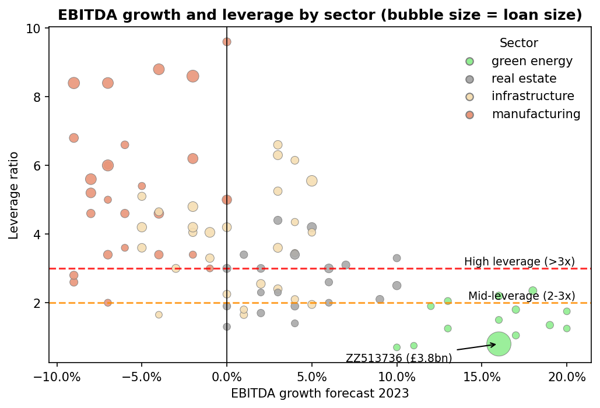

# Loan portfolio acquisition analysis

## Objective
In January 2023, a bank is considering buying a portfolio of 100 loans from another bank and can buy all, some or none of it. The goal is to assess the portfolio's risk using leverage (loan size / EBITDA) and EBITDA growth forecasts, and recommend which loans to acquire.

This was a take-home exercise with a 90 minute time limit and two outputs:
- a one-page summary for senior management (PDF)
- a notebook with the underlying analysis for the Credit Risk team

## Project structure

```
├── data/                            # Loan portfolio data
├── images/                          # Charts generated by the notebook
├── report/                          # One-page summary for senior management
├── loan_portfolio_analysis.ipynb    # Analysis notebook
├── requirements.txt
└── README.md
```

## Methodology
- Data cleaning: missing values, duplicates, inconsistent sector names
- Outlier review: separating data errors from genuine extreme values
- Portfolio and sector breakdown
- Concentration analysis
- Risk and growth assessment by sector
- Forward leverage using forecast 2023 EBITDA, with a downside check
- Comparison of acquisition options

## Results
- The portfolio is worth **£21.1bn across 89 loans** after cleaning. 54% of loans are high leverage (> 3x) and 39% have a negative growth forecast.
- **One client accounts for 18% of loan value and 51% of total EBITDA.** Aggregate leverage is 2.25x with this client but 3.7x without it, so the headline numbers hide the real risk.
- **Green energy and real estate are the most attractive sectors** (median leverage 1.4x and 2.6x, growth 16% and 4%). **Manufacturing should be avoided** (5.0x, -6%).
- **Forward leverage widens the gap between sectors.** Based on forecast 2023 EBITDA, green energy and real estate de-lever further, while median manufacturing leverage rises from 5.0x to 5.4x.



## Recommendation
Acquire the low and mid-leverage loans (3x or below) with positive growth, excluding the largest client: **34 loans, £3.6bn, 2.0x leverage (1.86x forecast for 2023) and 7.4% growth**. Leverage stays below 2x even if growth is 5 points lower than forecast. Decide on the largest client separately after verifying its financials and checking it against concentration limits.

| Option | Loans | Value | Leverage 2022 | Leverage 2023 (forecast) | Growth |
|---|---|---|---|---|---|
| Full portfolio | 89 | £21.1bn | 2.25x | 2.07x | 8.8% |
| Option 1: low leverage, positive growth | 19 | £5.2bn | 0.92x | 0.80x | 14.8% |
| Option 2: low and mid leverage, positive growth | 35 | £7.4bn | 1.13x | 0.99x | 13.6% |
| **Option 2 excluding largest client** | **34** | **£3.6bn** | **2.00x** | **1.86x** | **7.4%** |

## How to run
```
pip install -r requirements.txt
jupyter notebook loan_portfolio_analysis.ipynb
```
